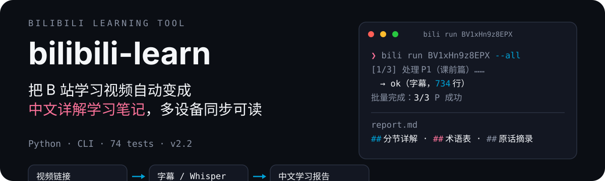
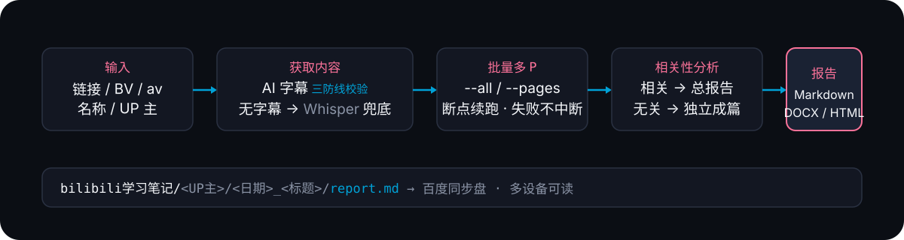

<p align="center">
  
</p>

**bilibili-learn** 把 B 站学习视频自动变成**中文详解学习笔记**：给出视频链接、BV 号或视频名称，自动抓取字幕（或 Whisper 转写），生成带详解、术语表、原话摘录的学习报告，归档到本地/同步盘，随时多设备可读。

> 一个真实产出示例（《Python入门半小时，剩下靠AI》，UP 主 王小二数据分析，21 分钟视频 → 17KB 报告）：
>
> `bilibili学习笔记/王小二数据分析/2026-08-20_Python入门半小时，剩下靠AI/report.md`
> 包含：一句话总结 → 10 节分节详解（要点+解释+例子）→ 22 条术语表 → 原话摘录（附时间点）→ 学习路径建议

## 快速开始

```bash
pip install -r requirements.txt

# 准备登录 cookie（搜索与 AI 字幕需要）：
#   把 SESSDATA=xxx 写入 scripts/.bili_cookie（已 gitignore，不会泄露）

# 单视频总结
python scripts/bili.py run "BV1xHn9z8EPX"

# 批量多 P（推荐学习场景）
python scripts/bili.py run "BV1rpWjevEip" --pages "1-50" --out "D:\学习笔记"

# 收藏夹直达（直接总结你收藏的视频）
python scripts/bili.py favs                        # 列出全部收藏夹
python scripts/bili.py run --fav "破蛋崽子" --pick 2 # 总结收藏夹第2个视频
python scripts/bili.py run --fav 104335690 --all    # 按收藏夹id批量总结

# 从已有字幕重新生成报告骨架 / 导出为 Word
python scripts/bili.py report "D:\学习笔记\王小二数据分析\2026-08-20_xxx"
python scripts/bili.py export "D:\学习笔记\王小二数据分析\2026-08-20_xxx" --format docx
```

> ⚠️ 国内网络首次下载 Whisper 模型需走镜像：
> `HF_ENDPOINT=https://hf-mirror.com HF_HUB_DISABLE_XET=1 python scripts/bili.py ...`

## 为什么不同

| 能力 | 说明 |
|------|------|
| 🎯 输入自由 | 链接 / BV / av / 名称 / UP 主 都能定位视频 |
| 🛡️ 字幕三防线 | 两次一致性 + 时长覆盖率 + 上限校验——拦截 bilibili 接口的错乱/降级字幕，宁可慢不可错 |
| 🔊 Whisper 兜底 | 无字幕视频自动转写：GPU 误报回退 CPU、VAD 滤空自动重试、语气词清洗 |
| 📚 批量多 P | `--pages "1-100"` 断点续跑、失败不中断、进度与预计剩余时间 |
| 🧠 相关性聚类 | 相关分P合并为总报告（按P分章），无关独立成篇，不一刀切 |
| 📤 随处可读 | 按 UP 主归档到同步盘，导出 Markdown / DOCX / HTML |

## 工作原理

<p align="center">
  
</p>

1. **定位**：链接/BV/av 直接解析；名称/UP 主走官方搜索（wbi 签名）
2. **获取**：AI 字幕优先（三防线校验），无字幕降级 faster-whisper 本地转写（CPU/GPU 自适应，无需系统 ffmpeg）
3. **批量**：多 P 循环处理，每 P 完成后增量写汇总，中断可 `--resume` 续跑
4. **分析**：agent 读取各 P 字幕做相关性聚类，决定总报告（按P分章）或独立报告
5. **交付**：报告写入同步盘 `bilibili学习笔记/<UP主>/`，可按需导出 Word/HTML

## 命令参考

| 命令 | 作用 |
|------|------|
| `bili resolve <输入>` | 解析链接/BV/av → bvid/页码 |
| `bili search <关键词>` | 搜索视频候选（需登录 cookie） |
| `bili favs` | 列出账号全部收藏夹（需登录 cookie） |
| `bili run <输入> [--page N \| --pages "1-10" \| --all]` | 获取字幕/转写并落盘；`--resume` 断点续跑；`--lang ja/en` 多语言字幕；`--model medium` 转写模型 |
| `bili run --fav <收藏夹名\|id> --pick N` | 直接总结收藏夹内第 N 个视频（输入参数可省略） |
| `bili report <目录>` | 从已有字幕重新生成报告骨架（改模板后无需重抓） |
| `bili export <目录> --format html\|docx` | 报告导出 |

## 配置（可选）

首次运行自动生成 `scripts/config.json`：

```json
{
  "out_dir": "",              // 默认输出目录（--out 未传时使用）
  "whisper_model": "small",   // tiny/small/medium/large-v3
  "hf_endpoint": "",          // HF 镜像（如 https://hf-mirror.com）
  "hf_disable_xet": true      // 镜像站必需
}
```

优先级：**CLI 参数 > 环境变量 > config.json > 默认值**。

## 报告结构

```
一句话总结
知识点全览（学习地图：全部知识点编号清单）
知识详解（按时间轴切段，每段标注时间戳：
  段内每个知识点分点 = 官方定义 + 通俗解释 + 浓缩细节
  + 例子 + 趣味彩蛋（原话摘录）+ 延伸标注）★核心
关键概念 / 术语解释表
金句与重要观点
原话摘录（5~10 条带时间点的教学性原话）
学习路径与自测（收获总结 + 自测题清单）
```

> 学习导向硬性规则：覆盖视频每一个知识点（对照字幕核对）、
> 删除口播废话只留知识、官方+通俗双版本、趣味彩蛋提升学习乐趣、
> 延伸知识点标注解释、报告文件名含视频标题（<标题>_学习报告.md）。

> 学习导向硬性规则：覆盖视频每一个知识点（对照字幕核对）、
> 删除口播废话只留知识、报告长度无上限（学习价值优先）。

## 测试与安全

- **74 个单元测试**：`python -m pytest tests/ -v`（全部 mock 网络，离线可跑）
- **登录 cookie 仅存于本地** `scripts/.bili_cookie`（gitignore），上传仓库时已排除；代码中只有 `SESSDATA=xxx` 占位示例
- 无 cookie 时降级可用：视频信息 + Whisper 转写仍正常工作，仅搜索与 AI 字幕受限

## 环境要求

- Python 3.10+
- requests（字幕/搜索 API）
- faster-whisper（可选：无字幕视频的本地转写；PyAV 自带 FFmpeg 库，无需系统安装 ffmpeg）
- python-docx（可选：DOCX 导出）

## 致谢与许可

项目源于个人学习需求：B 站教学视频多、倍速看记不住，于是做了这个「视频 → 学习笔记」的自动化流水线。欢迎 Issues 交流想法。
